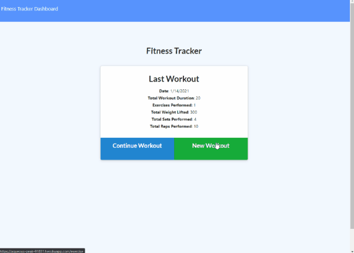

# WorkoutTracker

[](https://opensource.org/licenses/MIT)

The Live Demo is on Heroku, [here](https://aqueous-peak-91831.herokuapp.com/).

## Table of Contents
* [Description](#Description)
  * [Further Possibilities](#Further-Possibilities)
  * [Built With](#built-with)
* [Installation](#Installation)
* [Usage](#Usage)
* [License](#License)
* [Contributing](#Contributing)
* [Questions](#Questions)

## Description
A workout tracking application made to explore MongoDB and Mongoose.

[](https://aqueous-peak-91831.herokuapp.com/)


### Further Possibilities


### Built With

* Node.js
    * [express](https://www.npmjs.com/package/express)
    * [morgan](https://www.npmjs.com/package/morgan)
* MongoDB
    * [mongoose](https://www.npmjs.com/package/mongoose)

## Installation
To install app dependencies, run this command in your terminal:
```
npm i
```

To add the provided seed data, run this command after installation:
```
npm run seed
```

## Usage
Before using the program, a MongoDB connection must be established. The app will create its own database without further intervention, please edit the "server.js" file to control what name it uses.

## License
This project uses the MIT license. For more details, visit [this link](https://choosealicense.com/licenses/mit/).

## Contributing
Create a fork and send a pull request, or send me an email!

## Questions
If you have questions to ask or issues to report, please visit the [GitHub repository](https://github.com/ziieng/EmployeeDatabase) for this project, [my GitHub profile](https://github.com/ziieng), or send me an email at cjengelhardt@gmail.com.